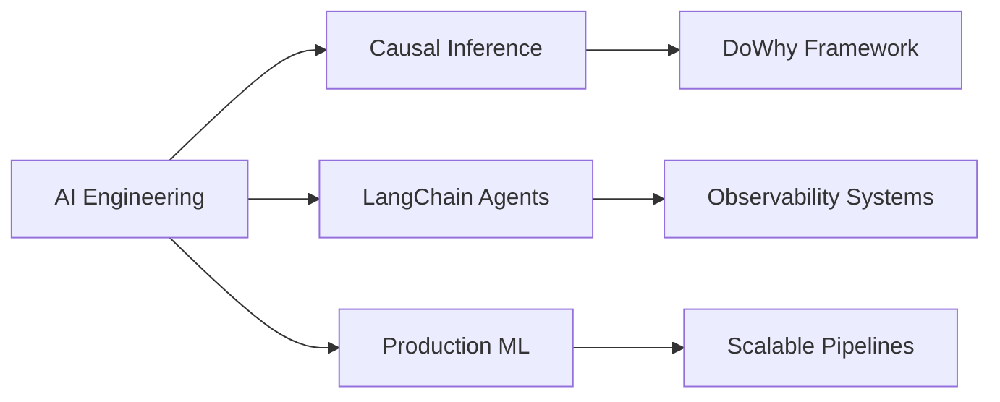

# Hi there, I'm Nitish Belagali 👋

<div align="center">
  
  [](https://git.io/typing-svg)
  
  <p>
    <a href="mailto:nitish.belagali@gmail.com"></a>
    <a href="https://linkedin.com/in/nitishbelagali"></a>
    <a href="https://nitishbelagali.github.io"></a>
  </p>
  
</div>

---

## 🚀 About Me

I'm a **data generalist** with **3.5+ years** of experience bridging raw data and business value. While my background is in BI and Data Engineering, my passion lies in **AI Engineering**—building agents that don't just chat, but _do_ work.

- 🎓 **MS in Information Systems** @ Northeastern University (3.7 GPA)
- 💼 Currently: **IT Data Analyst Co-op** @ Boehringer Ingelheim
- 🏢 Previously: IBM, Accenture
- 🌍 Based in: **Boston, MA**
- ⚽ Fun fact: Chelsea FC fan, fitness enthusiast, 5 tattoos

```python
class NitishBelagali:
    def __init__(self):
        self.role = "AI Engineer & Data Analyst"
        self.current_focus = ["AI Agents", "Causal Inference", "Data Observability"]
        self.learning = ["Advanced LangChain", "Production ML Systems"]
        self.tools = {
            "ai": ["LangChain", "OpenAI", "DoWhy", "Polars"],
            "data": ["Spark", "Airflow", "DuckDB", "SQL"],
            "cloud": ["AWS", "Azure", "Docker"],
            "viz": ["Tableau", "Power BI", "Plotly"]
        }
    
    def current_project(self):
        return "Building Causal Sentinel - Open source AI observability platform"
```

---

## 🔥 Featured Projects

### 🛡️ [Causal Sentinel v2.0](https://github.com/nitishbelagali/causal-sentinel)
**Enterprise AI Observability Platform**

An autonomous system that ingests logs from GitHub/Jira/Slack, detects revenue crashes, and uses **Causal Inference** to mathematically prove financial impact.

```python
Impact = E[Revenue | Bug] - E[Revenue | No Bug]
# Output: "This bug caused a $572k loss"
```

**Tech Stack:** `Python` `DoWhy` `OpenAI GPT-4o` `Streamlit` `Plotly`

**Why it matters:** Replaces $50k+ tools like Datadog/Dynatrace with open-source intelligence that proves causation, not just correlation.

---

### 🕵️‍♂️ [Skeptic Analyst Agent](https://github.com/nitishbelagali/skeptic-analyst)
**Human-in-the-Loop AI Data Analyst**

An AI agent that audits dirty data *before* analyzing it. Uses **Polars** for high-speed checks to prevent LLM hallucinations.

**Key Innovation:** "Guilty until proven innocent" approach—halts execution if data quality issues detected.

**Tech Stack:** `LangChain` `DuckDB` `Polars` `GPT-4o` `Streamlit`

---

### 🎵 [Spotify Data Pipeline](https://github.com/nitishbelagali/spotify-pipeline)
**Cloud-Native ETL Architecture**

End-to-end data pipeline processing millions of rows with Spark on AWS EMR, orchestrated by Airflow.

**Impact:** 
- ⚡ 50% reduction in query latency
- 📊 30% improvement in processing efficiency
- 🔄 Automated daily ingestion of 1M+ records

**Tech Stack:** `AWS EMR` `Airflow` `Spark` `Redshift` `Power BI`

---

### 💬 [RAG Chatbot for Policy Documents](https://github.com/nitishbelagali/rag-chatbot)
**Enterprise Knowledge Retrieval System**

FastAPI + ChromaDB backend with accurate retrieval and source citations for internal policy documents.

**Tech Stack:** `FastAPI` `ChromaDB` `Streamlit` `Docker`

---

## 💼 Professional Experience

### 🏢 **Boehringer Ingelheim** | IT Data Analyst Co-op
*Danbury, CT | Jan 2025 - Present*

- 🔄 Automated export of **50M+ Oracle rows** into distributed pipelines → **90% reduction** in manual effort
- 📊 Built Power BI dashboards → **70% faster** reporting cycles
- 🧪 Modularized R Shiny apps across **5+ scientific domains**

### 🏢 **IBM** | Technical Services Specialist
*Bengaluru, India | Aug 2021 - Jun 2023*

- ⚡ Optimized Informatica → Airflow ETL → **45% performance boost**, **40% time reduction**
- 📈 BigQuery data strategies → **50% fewer errors**, **18% client acquisition increase**
- 📊 Delivered Tableau dashboards improving business-critical feature delivery

### 🏢 **Accenture** | Associate Software Engineer
*Bengaluru, India | Feb 2021 - Aug 2021*

- 📊 Built Tableau dashboards → **25% customer satisfaction increase**
- 💰 Advanced analytics → **20% revenue growth**, **35% cost reduction**

---

## 🛠️ Technical Arsenal

### AI & Machine Learning


### Data Engineering & Databases


### Cloud & DevOps


### BI & Visualization


---

## 📊 GitHub Stats

<div align="center">
  
  
  
  
</div>

<div align="center">
  
  [](https://git.io/streak-stats)
  
</div>

---

## 🏆 Achievements & Highlights

- 🎓 **Teaching Assistant** - Application Engineering & Design (Fall 2024) - Supported ~200 students
- 🧠 **Independent Research** - AI-augmented BI pipelines with automated insights
- 🏛️ **General Secretary** - KLE Tech (2019-2020) - Represented 2000+ students
- 🤝 **Community Leader** - Led Dharwad flood relief campaign, raised ₹2,00,000 (~$2,600)

---

## 📈 Impact By The Numbers

<div align="center">

| Metric | Impact |
|--------|--------|
| 💾 **Data Processed** | 50M+ rows automated |
| ⚡ **Efficiency Gains** | 90% reduction in manual effort |
| 📊 **Reporting Speed** | 70% faster dashboards |
| 🔄 **ETL Optimization** | 45% performance boost |
| 💰 **Cost Savings** | 35% operational reduction |

</div>

---

## 🎯 Current Focus



- 🔬 Building production-grade AI agents with human oversight
- 📊 Applying causal inference to business problems
- 🚀 Creating open-source alternatives to expensive enterprise tools
- 📚 Deepening knowledge in advanced LangChain patterns

---

## 📝 Latest Blog Posts

<!-- BLOG-POST-LIST:START -->
- 🛡️ [Building Causal Sentinel: Why Correlation Isn't Enough](https://medium.com/@nitishbelagali)
- 🕵️ [Stop LLM Hallucinations: The Skeptic Analyst Pattern](https://medium.com/@nitishbelagali)
- ⚡ [From Informatica to Airflow: Modern ETL Architecture](https://medium.com/@nitishbelagali)
<!-- BLOG-POST-LIST:END -->

---

## 💬 Let's Connect!

I'm always interested in:
- 🤝 Collaborating on open-source AI/data projects
- 💼 Full-time opportunities in AI Engineering, Data Analytics, or BI
- ☕ Coffee chats about causal inference, LangChain, or Chelsea FC

<div align="center">
  
  **📧 Email:** nitish.belagali@gmail.com
  
  **🌐 Portfolio:** [nitishbelagali.github.io](https://nitishbelagali.github.io)
  
  **💼 LinkedIn:** [linkedin.com/in/nitishbelagali](https://linkedin.com/in/nitishbelagali)
  
</div>

---

<div align="center">
  
  ### 🌟 If you find my work interesting, consider starring my repos!
  
  
  
  ---
  
  ⭐️ From [nitishbelagali](https://github.com/nitishbelagali) with ❤️
  
  *"Building AI systems that don't just chat, but do work"*
  
</div>
